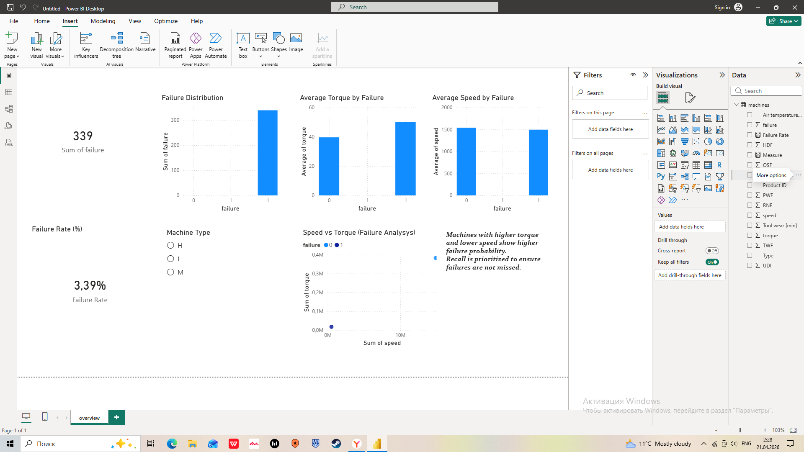

# Predictive Maintenance: Machine Failure Analysis and Dashboard

## Overview

This project analyzes machine sensor data to identify patterns leading to equipment failures and supports decision-making through an interactive Power BI dashboard.

The work combines exploratory data analysis, machine learning modeling, and business-oriented visualization to simulate a real-world predictive maintenance use case.

## Business Objective

The objective is to reduce operational downtime and maintenance costs by detecting high-risk machines in advance and enabling proactive intervention.

## Dataset

The dataset contains approximately 10,000 observations of machine operations with the following features:

- Air temperature
- Process temperature
- Rotational speed
- Torque
- Tool wear
- Machine type (L, M, H)

Target variable:
- `failure` (0 = normal operation, 1 = failure)

Key characteristic:
- Strong class imbalance (~3% failures)

## Methodology

### Data Preparation
- Renamed columns for consistency and usability
- Verified data types and handled aggregation issues
- Performed basic validation (missing values, distributions)

### Exploratory Data Analysis
- Compared feature distributions between failure and non-failure cases
- Identified relationships between torque, speed, and failure
- Observed correlation patterns between key variables

### Modeling

Two models were implemented:

- Logistic Regression (baseline)
- Random Forest (final model)

Evaluation metrics:

- Accuracy: ~0.98
- Recall (failure class): ~0.57
- ROC-AUC: ~0.90

Given the imbalance in the dataset, recall was prioritized over accuracy to minimize missed failures.

## Power BI Dashboard

The Power BI dashboard translates analytical results into an interactive monitoring tool.

### Key Components

**Overview Page**
- Failure rate KPI
- Average torque and temperature
- Failure distribution

**Analysis Page**
- Average torque by failure
- Average speed by failure
- Comparative behavior of key variables

**Interactive Filtering**
- Machine type segmentation (L, M, H)

**Relationship Analysis**
- Scatter plot: speed vs torque with failure classification

## Key Insights

- Higher torque is strongly associated with increased failure probability
- Lower rotational speed indicates degradation prior to failure
- Temperature contributes to failure risk but is less dominant than torque
- The dataset is highly imbalanced, significantly affecting model behavior and evaluation

## Files

- `predictive_maintenance_ml.ipynb` — data analysis and modeling
- `predictive_maintenance_dashboard.pbix` — Power BI dashboard
- `dashboard.png` — dashboard preview

## Dashboard Preview

## Conclusion

The Random Forest model provides a better balance between precision and recall compared to Logistic Regression.

The combined analytical and visualization approach enables:

- monitoring of machine health
- identification of failure drivers
- support for proactive maintenance decisions

---

## Future Improvements

- Address class imbalance using techniques such as SMOTE
- Perform hyperparameter tuning
- Introduce additional models for comparison
- Implement real-time data integration and monitoring
